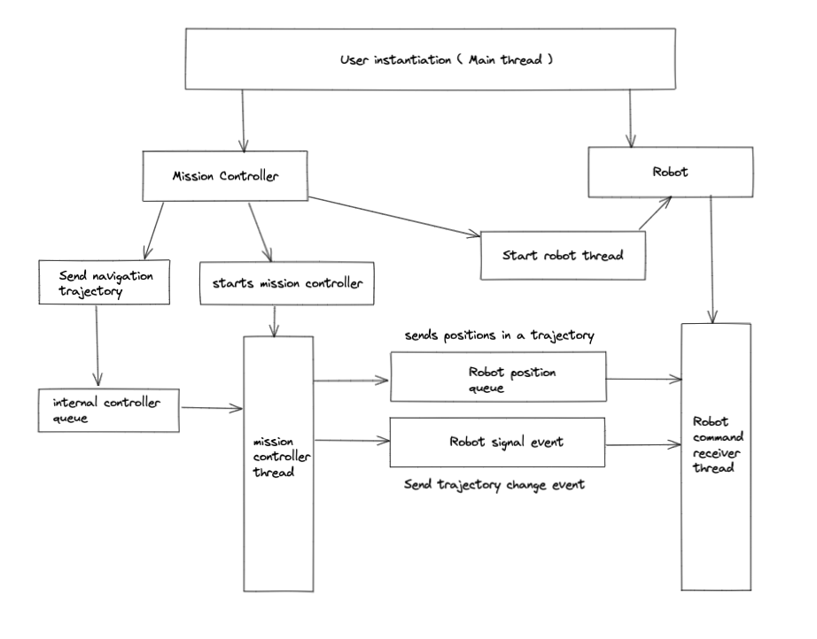

## Assumed problem scenario 

* The robot begins with coordinates (2, 1). 
* We submit a trajectory with points ((4, 3), (5, 3)).
* The robot starts to move to (4, 3).
* We submit a trajectory with points ((3, 3), (5, 4)).
* The robot starts to move to (3, 3) instead of (4, 3).
* The robot arrives at (3, 3), and starts to move towards (5, 4).
* The robot receives a trajectory with points ().
* The robot stops.

## Design Philosophy 

Goal : Free flow of Robot and controller thread while simulating interrupt messages for robot

### Simulated Robot 
Robot is self sufficient to perform basic movement tasks. It does the following. 
    - Only receives relevant position from the mission controller
    - Aware of its current position 
    - Verifies if Received position is same as current position
    - Manage its own state and memory
    - Listen to Mission Controller on demand

## Mission Controller
Mission controller is the kernel of the operation. Commands the robot to move based on the trajectory 
received from the user 
    - A Single flow control to maneuver the robot
    - Aware of the state of Robot operation
    - Managed its own state and memory 
    - Only sends the relevant position in the trajectory for robot to move
    - Takes care of passing necessary interrupts, signals and event information 
    - Has the ability to stop the robot ( kill the robot thread )

## Best Practices followed  
- Using Queues to transfer data between the threads -> Thread safe data struct, has internal RLock mechanism 
- Using Events to control the flow between the thread

## Architecture design 

 
